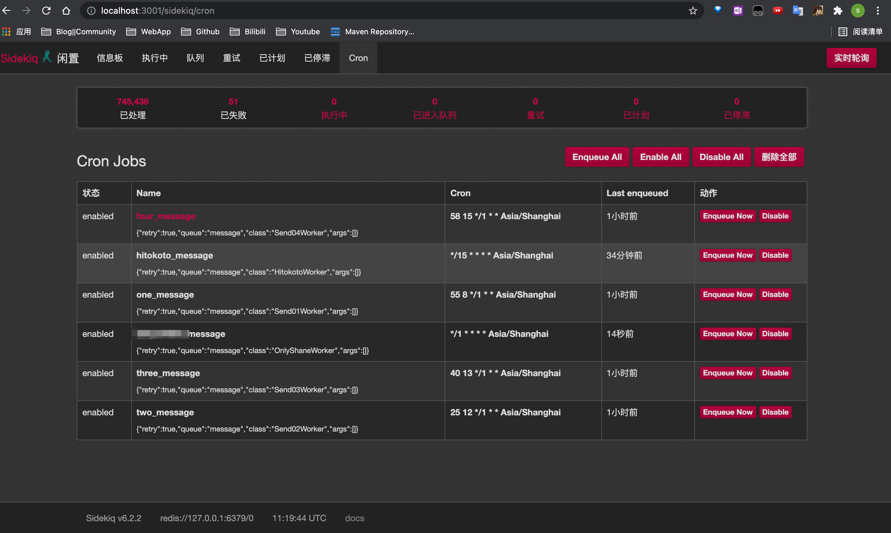

# Rails定时任务框架Sidekiq + 飞书机器人

## 项目背景

​	Sidekiq定时任务与飞书机器人的一个实践，简单的每天特定的时间段提醒我该干啥(没啥用，不过挺好玩的)

## 涉及到的技术点

​	Linux

​	Ruby on Rails

​	Python3

​	Sidekiq

## docs

[飞书开发文档](https://open.feishu.cn/document?lang=zh-CN)

## 使用说明

1. ssh进自己的服务器,clone本项目

2. 进入robot_task/,运行以下命令

   ```shell
   bundle install
   rails db:create
   rails db:migrate
   ```

3. 进入飞书开发者后台获取APP_ID，APP_SECRET，APP_VERIFICATION_TOKEN

4. 将APP_ID，APP_SECRET，APP_VERIFICATION_TOKEN填入到**echo_bot.py**，**echo_bot/robot_task/app/workers/uri.rb**中的对应位置

5. 进入rails console添加Staff

   ```shell
   rails c
   Staff.all
   Staff.create!(name:"***", email:"***.**@**.com", user_id:"***")
   ```

6. 运行python代码和rails项目

   ```shell
   nohup python3 -u echo_bot.py
   cd robot_task/
   rails s -b 0.0.0.0 -p 3001
   bundle exec sidekiq -C config/sidekiq.yml
   ```

## 页面

